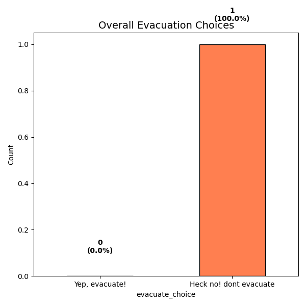
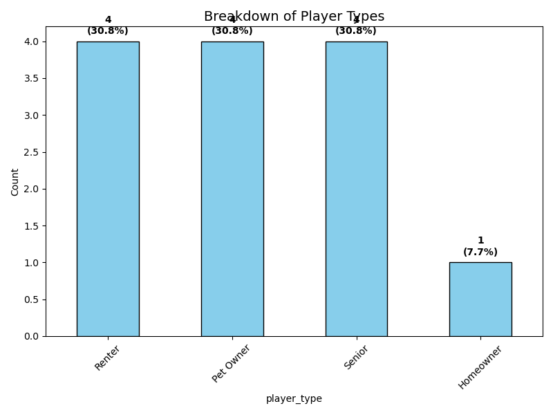

#Results!

Below are some most recent results from players of the game up until this website was published. 

In the literature, it is documented that homeowners and pet owners are less likely to evacuate because they want to protect their homes and their animals.  

- What do you see in the results? 
- What would you do as a next step
	- Dig deeper into the questions?
	- Move away from a game to more formal planning?
	- Other thoughts?

Note that these figures may be old, or if there is a live session right now, 
they may be the result of only today's entries.

## Contact info:
Daniel Osgood, PhD
Financial Instruments Division Lead
1.212.853.5720
Daniel.Osgood@columbia.edu 

National Center for Disaster Preparedness, IRI Affiliate

475 Riverside Drive, Suite 820
New York, NY 10115-0095
ncdp@columbia.edu  https://ncdp.columbia.edu/fi

