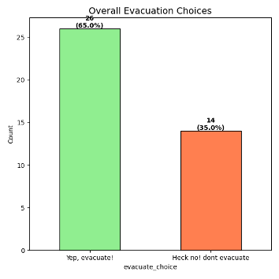
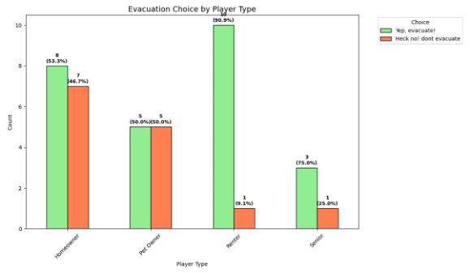

#Evacuate Results!

Below are some most recent results from a previous simulation session. 

The literature says people with animals are less likely to evacuate, (eg doi.org/10.3390/ani5020173)

Below are some results--what do you see? 
  

Animal owners were less likely to evacuate and renters were most likely to evacuate in that session, reflecting what has been seen in the literature.  

For disaster preparedness, actions could be taken, such as providing transportation and shelter that has the capacity to support animals.

What other follow up actions and communications could be done?

