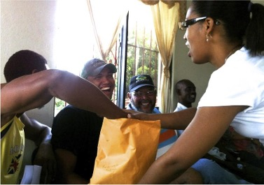

# Simulation Scenarios

- Simulations, tabletops, and role-play are often effective disaster preparedness tools

- These strategies have been effective in many applications Games 2020, 11(4), 47; https://doi.org/10.3390/g11040047

- For example, there are many challenges in communication about disaster evacuation

	- Hypothetical Simulations and role-play may provide a safe space for working through challenging topics

## We are exploring new strategies for disaster preparedness communication possible with two way phone messaging based on scenarios and role play

- Interactive, scenario-based learning

- Guess what other players would do in scenario

- Possibilities: 

	- Safe space for sensitive issues 

	- Move from one-way SMS alerts into…

	- Two-way communication between community and leadership

	- Communication with each other in the community

### Some Goals and Key Considerations
- Increased preparedness and situational awareness among Tribal Nations

- Real-time insights for emergency managers

- Improved trust and engagement with residents

- Data Sovereignty: Tribes have the inherent right to govern the collection, ownership, access, and use of data for their people, land, and resources

- Establishing partnerships with Tribal leaderships increase communication, trust, and accountability

- Incorporating the perspectives of Tribal elders and youth provides connection to culture and community

- Ensure accessibility across age, literacy, and language

### Initial steps involve defining templates for families of strategies 

- Moving from planning documents to lived decision-making

- What risk communication “in action” looks like during disasters that strike Tribal Nations

#### Available to be tailored by Tribal Nations or other implimenters as appropriate.

### Templates we are currently exploring

1) Sensitive Issue Safe Space: Evacuation 

2) Coordination in complex evolving situations: Shelter

