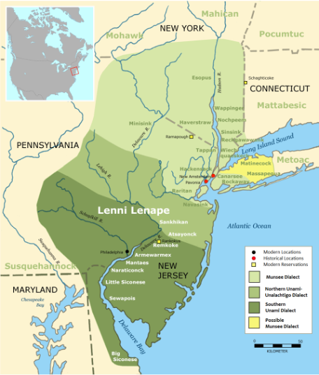

# Columbia University Land Acknowledgement 

**The Lenni-Lenape, Wappinger and Oneida people lived on this land before and during colonization of the Americas. We recognize these Indigenous people of Manhattan, their displacement, dispossession, and continued presence. We are reminded to reflect on our past as we contemplate our way forward to support Indigenous people and other marginalized communities of this land and advance our commitment to justice.**

